# 📚 북꾸북꾸 - 독서 큐레이션 SNS
## 🛠 프로젝트 소개

### 북꾸북꾸: 독서 큐레이션 SNS
**나만의 서재를 가꾸고, 독서 기록을 쉽게 관리하세요!**

- **개발 기간**: 2024.07.02 ~ 2024.08.16 (약 6주)
- **개발 인원**: 6인 (프론트엔드 3인, 백엔드 3인)
- **배포 URL**: [북꾸북꾸](https://i11a506.p.ssafy.io)

### 📖 프로젝트 개요
**북꾸북꾸**는 **BOOK**과 **꾸미다**의 합성어로, 사용자들이 자신의 독서 경험을 아름답게 꾸미고 공유할 수 있는 독서 큐레이션 SNS 플랫폼입니다. 독서 기록의 체계적인 관리부터 다른 독서가들과의 소통까지, 북꾸북꾸는 독서를 사랑하는 이들을 위한 종합 솔루션을 제공합니다.

### 🎯 목적
- **독서 기록의 체계화**: 단순한 책 목록을 넘어, 사용자의 감정과 생각을 담은 독서 기록을 손쉽게 관리할 수 있도록 지원합니다.
- **독서 커뮤니티 활성화**: 한줄평, 큐레이션 레터, 북톡 등 다양한 소통 수단을 통해 독서가들 간의 활발한 교류를 촉진합니다.
- **독서 습관 형성**: 독서 통계 등의 기능을 통해 사용자들이 지속적으로 독서에 관심을 가질 수 있도록 도와줍니다.

### 🎯 타겟
- **독서를 사랑하는 모든 이들**: 책을 좋아하고, 자신의 독서 경험을 남기고 공유하고 싶은 사람들.
- **독서 습관을 기르고 싶은 분들**: 독서 기록을 체계적으로 관리하며, 독서량을 늘리고 싶은 사용자.
- **다른 독서가들과 소통하고 싶은 분들**: 책에 대한 다양한 의견과 감상을 공유하고, 새로운 책을 추천받고 싶은 사람들.

### 📝 서비스 개요
- **서재 관리**: 사용자는 최대 3개의 서재를 생성하여 책을 분류하고, 각 서재를 자신만의 스타일로 꾸밀 수 있습니다.
- **한줄평 기능**: 읽은 책에 대한 간단한 감상을 남기고, 다른 사용자의 한줄평을 탐색하며 새로운 독서 아이디어를 얻을 수 있습니다.
- **큐레이션 레터**: 사용자들은 자신만의 독서 취향을 담은 큐레이션 레터를 작성하여 다른 사용자들과 공유할 수 있습니다.
- **북톡(독서 커뮤니티)**: 실시간 채팅을 통해 책에 대한 다양한 의견을 나누고, 독서 모임을 진행할 수 있습니다.
- **독서 통계**: 자신의 독서 패턴을 시각화하여 파악하고, 독서 습관을 형성하는 데 도움을 줍니다.
- **글귀 보관** : 사용자는 책에서 인상깊었던 글귀를 사진/텍스트를 통해 쉽게 보관할 수 있습니다.

### 🚀 타 서비스와의 차별성
- **사용자 중심의 서재 커스터마이징**: 단순한 책 목록이 아닌, 사용자의 개성을 담은 서재를 꾸밀 수 있습니다.
- **큐레이션 기반 소통**: AI 챗봇과의 대화를 통해 개인 맞춤형 책 추천을 받거나, 큐레이션 레터를 통해 사용자 간의 깊이 있는 소통이 가능합니다.
- **손쉬운 독서 기록**: 복잡한 절차 없이도 책을 등록하고, 감상을 남기며, 이를 다른 사용자들과 공유할 수 있습니다.
- **독서 습관 강화 도구 제공**: 독서 통계 등의 기능을 통해 사용자의 독서 패턴을 분석하고, 지속적인 독서 활동을 장려합니다.
- **글귀 보관** : 사용자는 책에서 인상깊었던 글귀를 사진/텍스트를 통해 쉽게 보관할 수 있으며 배경 사진과 폰트 설정 등 다양한 커스터마이징을 할 수 있습니다.

> **북꾸북꾸**는 독서 경험을 더 풍부하게 만들고, 사용자가 자신의 독서 취향을 공유하며 다른 사용자들과 교류할 수 있는 플랫폼을 목표로 합니다.

## 🌟 주요 기능

### 회원 관리
- **이메일 가입**: 
    - 사용자는 이메일, 비밀번호, 닉네임을 입력하여 회원으로 가입할 수 있습니다. 
    - 추가 정보(연령, 성별, 선호 카테고리)를 필수로 입력하여 더욱 개인화된 경험을 제공합니다.
- **소셜 회원가입/로그인**: 
    - 카카오, 네이버, 구글 등의 소셜 로그인으로 간편하게 회원가입 및 로그인이 가능합니다. 
    - 이를 통해 사용자는 복잡한 절차 없이 서비스에 접근할 수 있습니다.
- **비밀번호 초기화**: 
    - 사용자는 이메일 인증을 통해 비밀번호를 손쉽게 초기화할 수 있습니다.

### 서재 관리
- **서재 생성**: 
    - 사용자는 개인 맞춤형 서재를 생성할 수 있습니다.
    - 최대 3개의 서재를 생성하여 관리할 수 있습니다.
- **서재 커스터마이징**: 
    - 사용자는 드래그 앤 드롭(drag-and-drop) 기능을 통해 서재 내 책을 쉽게 이동할 수 있습니다. 
    - 서재의 이름과 색상, 폰트 설정, 책의 색상 테마를 설정할 수 있습니다
- **책 등록 및 관리**: 
    - 사용자는 서재에 책을 등록하고, 읽은 상태 등을 기록할 수 있습니다.
    - 이렇게 등록된 책은 서재에 저장되어 쉽게 관리됩니다.
    - 한 서재에 최대 21권의 책을 등록할 수 있습니다.

### 한줄평 기능
- **한줄평 등록**: 
    - 사용자는 최대 70자까지의 한줄평을 작성하여 책에 대한 감상을 공유할 수 있습니다.
- **한줄평 삭제**: 
    - 등록된 한줄평을 삭제할 수 있습니다. 
    - 이는 사용자가 자신의 독서 경험을 자유롭게 표현하고 관리할 수 있도록 돕습니다.
- **한줄평 파도타기**: 
    - 다른 사용자의 한줄평을 탐색하며, 마음에 드는 사용자의 서재를 방문할 수 있는 기능입니다.
    - 이를 통해 새로운 책과 사용자와의 연결이 가능합니다.

### 큐레이션
- **큐레이션 챗봇**: 
    - 사용자는 자신의 선호 장르나 현재 기분에 따라 큐레이션 챗봇으로부터 책 추천을 받을 수 있습니다. 이는 개인화된 독서 경험을 제공합니다.
- **큐레이션 레터**: 
    - 사용자는 자신의 선호 카테고리가 비슷한 사용자에게 큐레이션 레터를 전송할 수 있습니다. 
    - 레터는 무작위로 3명의 사용자와 팔로워에게 전송되어 새로운 독서 기회를 제공합니다.
- **큐레이션 보관**: 
    - 받은 큐레이션 레터를 보관하고 관리할 수 있는 기능입니다. 이를 통해 사용자는 가치 있는 추천서를 지속적으로 참고할 수 있습니다.

### 마이페이지
- **개인정보 수정**: 
    - 사용자는 프로필 사진, 닉네임, 비밀번호, 연령, 성별, 선호 카테고리 등을 쉽게 수정할 수 있습니다.
    -  이를 통해 지속적으로 자신의 계정을 최신 상태로 유지할 수 있습니다.
- **독서 통계**: 
    - 도넛 차트를 통해 카테고리별 독서량을 시각적으로 확인할 수 있습니다. 
    - 이는 사용자가 자신의 독서 습관을 분석하고 개선하는 데 도움을 줍니다.
- **내 글귀**: 
    - 사용자는 책에서 인상적인 글귀를 사진이나 텍스트 형태로 저장하여 보관할 수 있습니다.
    - 이는 독서 중 발견한 소중한 글귀를 쉽게 관리할 수 있게 합니다.
- **친구 관리**: 
    - 팔로잉, 팔로워 관리 및 닉네임을 통한 사용자 검색 기능을 제공합니다. 
    - 이를 통해 사용자는 자신의 네트워크를 확장하고 관리할 수 있습니다.

### 북톡(독서 커뮤니티)
- **커뮤니티 메인화면**: 
    - 사용자는 자신이 참여한 도서와 최근 인기 도서를 확인할 수 있습니다. 이를 통해 커뮤니티 활동을 활성화할 수 있습니다.
- **채팅방 생성 및 관리**: 
    - 책 검색을 통해 채팅방을 생성하고, 다른 사용자들과 책에 대해 소통할 수 있는 기능입니다. 이는 독서 경험을 공유하는 데 중점을 둡니다.
- **다른 사용자 서재 구경**: 
    - 사용자는 채팅방 내에서 다른 사용자의 서재를 탐색하고 그들의 독서 목록을 확인할 수 있습니다. 이를 통해 새로운 책과 사용자를 발견하는 기회를 제공합니다.

## 👨‍👩‍👧‍👧 팀원 소개

| **역할**     | **이름** | **담당**                                              |
|--------------|----------|-------------------------------------------------------------------|
| **Frontend** | 김지윤   | 팀장, UI 디자인, 프론트엔드 개발                                  |
|              | 김혁     | UI 디자인, 프론트엔드 개발                                       |
|              | 송예진   | UI 디자인, 프론트엔드 개발                                       |
| **Backend**  | 김인엽   | 서재 서버 개발(서재, 통계), 책 서버 개발(책, 카테고리, 한줄평)   |
|              | 김종호   | 큐레이션 서버 개발, 북톡 서버 개발(채팅 서비스), 인프라 설정     |
|              | 왕승철   | 유저/인증 서버 개발, 알림 서버 개발, 글귀 기능 개발              |

## ⚙ 개발환경

### Management Tool

### IDE

### Infra

### Frontend

### Backend

### **외부 API**

### 기술적 차별점

**북꾸북꾸**는 최신 기술 스택을 활용하여 사용자 경험을 극대화하고, 안정적이고 확장 가능한 서비스를 제공하기 위해 다음과 같은 기술적 차별점을 가지고 있습니다:

#### 프론트엔드
- **React DnD**: 서재 관리에서 직관적인 드래그 앤 드롭 경험을 제공하여 사용자 인터페이스의 편리성을 높였습니다.
- **애니메이션 효과**: Swiper와 React Transition Group을 활용해 부드러운 전환 효과와 UI 상호작용을 구현했습니다.
- **상태 관리**: Jotai와 React Query를 통해 효율적인 상태 관리를 구현하고, 서버와의 데이터 동기화를 실시간으로 유지합니다.
- **무한 스크롤**: React Intersection Observer를 활용해 성능 최적화된 무한 스크롤 기능을 구현했습니다.
- **실시간 통신**: SockJS와 StompJS를 통해 사용자 간 실시간 메시지 교환 및 알림 기능을 제공합니다.
- **시각적 통계 제공**: Chart.js와 react-chartjs-2를 사용하여 사용자의 독서 데이터를 시각적으로 표현해줍니다.

#### 백엔드
- **마이크로서비스 아키텍처**: 각 서비스가 독립적으로 배포되고 관리될 수 있는 마이크로서비스 구조를 채택하여 확장성과 유지보수성을 강화했습니다.
- **RESTful API**: Spring Boot를 기반으로 한 RESTful API를 통해 클라이언트와 서버 간의 효율적인 데이터 통신을 지원합니다.
- **데이터베이스 최적화**: 각 마이크로서비스는 자체 데이터베이스(PostgreSQL, Redis)를 보유하고 있으며, 서비스에 맞게 최적화되었습니다.
- **Eureka 서비스 디스커버리**: 서비스 간의 통신과 로드 밸런싱을 위해 Eureka를 사용하여 동적 서비스 디스커버리를 구현했습니다.

#### 인프라
- **컨테이너화**: Docker와 Docker Compose를 사용해 각 서비스를 컨테이너화하여 일관성 있는 개발 환경과 효율적인 배포를 구현했습니다.
- **리버스 프록시**: Nginx를 활용해 리버스 프록시를 구성, 트래픽을 효과적으로 분산 처리하고 보안을 강화했습니다.
- **CI/CD 파이프라인**: Jenkins와 GitLab을 통해 CI/CD 파이프라인을 구축하여 코드의 품질을 보장하고 자동 배포를 실현했습니다.
- **모니터링 및 로그 관리**: Prometheus와 Grafana를 통해 시스템 모니터링 및 알림을 설정하고, Loki와 Promtail을 사용해 로그를 수집 및 분석합니다.

## 📜 설계 문서
### 아키텍처 구조
MSA와 Event Driven Architecture를 적용하여 확장성과 유지보수성을 확보.
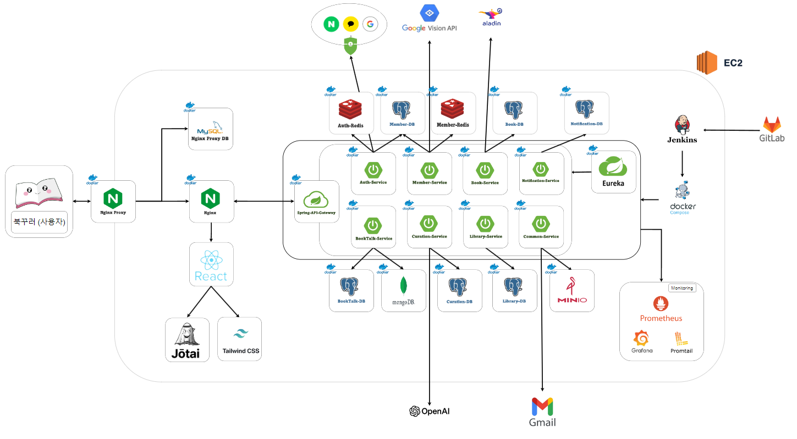

### ERD
관계형 데이터베이스(`PostgreSQL`)와 NoSQL (`MongoDB`)를 활용한 데이터 모델 설계.
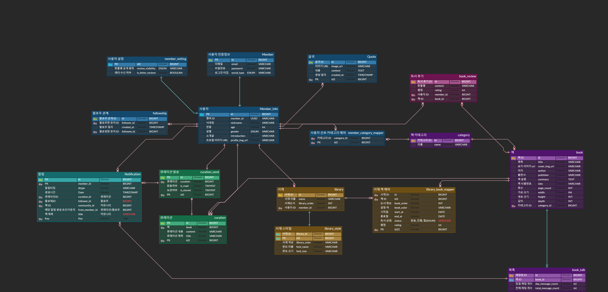

### 보안 및 성능 최적화

**북꾸북꾸**는 사용자 정보의 보호와 빠른 서비스 제공을 위해 다음과 같은 보안 및 성능 최적화 기술을 적용했습니다:

#### 보안
- **JWT (JSON Web Token)**: 사용자 인증을 위해 JWT를 사용하며, 클라이언트와 서버 간의 안전한 통신을 보장합니다. JWT 토큰은 HTTP 헤더에 포함되어 사용자의 요청을 인증합니다.
- **OAuth 2.0**: 소셜 로그인(Kakao, Naver, Google)을 통해 간편하면서도 안전하게 로그인할 수 있습니다.
- **비밀번호 암호화**: 사용자 비밀번호는 안전하게 암호화되어 저장되며, 탈취된 경우에도 안전하게 보호됩니다.

#### 성능
- **캐싱**: Redis를 활용하여 자주 사용되는 데이터를 캐싱함으로써 서버 부하를 줄이고 응답 속도를 개선했습니다.
- **무한 스크롤**: React Intersection Observer를 사용하여 사용자 경험을 향상시키기 위한 무한 스크롤을 구현했습니다.
- **실시간 통신**: SockJS와 StompJS를 사용하여 사용자의 액션에 실시간으로 반응할 수 있는 실시간 통신 기능을 구현했습니다.
- **GIN 인덱스 사용**: 책 제목, 저자, 출판사에 대한 `LIKE` 검색 최적화
- **스케일 아웃** : 사용자 정보 조회, 책 검색에 대한 요청이 빈번하여 `Member`, `Book` 서비스에 대한 컨테이너 스케일 아웃을 진행하여 성능 향상을 이끌었습니다.

>  **쿼리 성능 최적화 적용 결과**
> - **사용자 정보 조회** : 대략 <b>55%</b> 향상
> - **책 검색** : 대략 <b>78%</b> 향상

## API 명세
회원 관리, 서재 관리, 큐레이션, 북톡(커뮤니티) 등 주요 기능에 대한 API 명세

### Member 서비스 API 명세

| 주요 기능      | 상세 기능                                              | 메서드 | 요청 주소                                       | Request                                                                                                              | Response                                               |
|---------------|-------------------------------------------------------|--------|------------------------------------------------|----------------------------------------------------------------------------------------------------------------------|--------------------------------------------------------|
| 글귀 관리      | 글귀 목록 반환                                          | GET    | `/members/quote`                               | `pageable` (쿼리 파라미터)                                                                                           | `[ResponseQuoteDto]`                                   |
|               | 글귀 생성                                               | POST   | `/members/quote`                               | `quoteDto`, `backgroundImg` (multipart/form-data)                                                                    | `String`                                               |
|               | 글귀 수정                                               | PUT    | `/members/quote`                               | `quoteDto`, `backgroundImg` (multipart/form-data)                                                                    | `String`                                               |
|               | 글귀 삭제                                               | DELETE | `/members/quote/{quoteId}`                     | `quoteId` (PathVariable)                                                                                             | `String`                                               |
|               | 글귀 상세 조회                                          | GET    | `/members/quote/detail/{quoteId}`              | `quoteId` (PathVariable)                                                                                             | `ResponseQuoteDetailDto`                                |
|               | OCR 이미지 텍스트 추출                                  | POST   | `/members/quote/ocr`                           | `image` (multipart/form-data)                                                                                        | `String`                                               |
| 회원 관리      | 회원가입                                                | POST   | `/members/register`                            | `requestRegisterMemberDto`, `profileImg` (multipart/form-data)                                                       | `ResponseLoginTokenDto`                                |
|               | 인증번호 검증                                            | GET    | `/members/register/validation`                 | `requestCertificationDto` (쿼리 파라미터)                                                                            | `String`                                               |
|               | 이메일 인증 번호 발송                                    | POST   | `/members/register/validation`                 | `String` (application/json)                                                                                          | `String`                                               |
|               | 비밀번호 초기화                                          | POST   | `/members/register/password/reset`             | `String` (application/json)                                                                                          | `String`                                               |
|               | 닉네임 중복 체크                                         | GET    | `/members/register/duplicate/name`             | `name` (쿼리 파라미터)                                                                                               | `String`                                               |
|               | 이메일 중복 체크                                         | GET    | `/members/register/duplicate/email`            | `email` (쿼리 파라미터)                                                                                              | `String`                                               |
| 팔로우 관리    | 팔로우 요청                                              | POST   | `/members/follow/follow`                       | `RequestFollowShipDto` (application/json)                                                                             | `String`                                               |
|               | 언팔로우 요청                                            | POST   | `/members/follow/unfollow`                     | `RequestFollowShipDto` (application/json)                                                                             | `String`                                               |
|               | 팔로워 목록 반환                                         | GET    | `/members/follow/followers`                    | `RequestFollowShipDto` (쿼리 파라미터) (Optional)                                                                    | `[ResponseFollowShipDto]`                               |
|               | 팔로잉 목록 반환                                         | GET    | `/members/follow/followees`                    | `RequestFollowShipDto` (쿼리 파라미터) (Optional)                                                                    | `[ResponseFollowShipDto]`                               |
|               | 팔로우 취소                                              | DELETE | `/members/follow/{memberId}`                   | `memberId` (PathVariable)                                                                                            | `String`                                               |
| 멤버 정보 관리 | 멤버 정보 반환                                           | GET    | `/members/info`                                | `memberId` (쿼리 파라미터) (Optional)                                                                                | `ResponseMemberProfileDto`                              |
|               | 멤버 PK를 통한 멤버 정보 반환                            | GET    | `/members/info/id/{memberId}`                  | `memberId` (PathVariable)                                                                                            | `ResponseMemberInfoDto`                                 |
|               | 닉네임으로 멤버 ID(Long) 반환                             | GET    | `/members/info/name`                           | `nickName` (쿼리 파라미터)                                                                                           | `Long`                                                 |
|               | 닉네임으로 멤버 프로필 정보 반환                         | GET    | `/members/info/name/{nickName}`                | `nickName` (PathVariable)                                                                                            | `ResponseMemberProfileDto`                              |
|               | 멤버 추가 정보 수정                                      | PUT    | `/members/info`                                | `requestUpdateMemberInfoDto`, `profileImg` (multipart/form-data)                                                     | `String`                                               |
|               | 멤버 공개 범위 설정 변경                                 | PUT    | `/members/info/setting`                        | `RequestMemberSettingDto` (application/json)                                                                          | `String`                                               |
|               | 비밀번호 변경                                            | PATCH  | `/members/info/password`                       | `RequestUpdatePasswordDto` (application/json)                                                                         | `String`                                               |
|               | 큐레이션 레터 수신자들 반환                               | GET    | `/members/info/curation/recipients`            | `memberId` (쿼리 파라미터)                                                                                           | `[ResponseRecipientDto]`                               |
|               | 멤버 PK(Long)을 통한 멤버 ID 반환                         | GET    | `/members/info/{memberId}`                     | `memberId` (PathVariable)                                                                                            | `Long`                                                 |

### Authentification 서비스 API 명세

| 주요 기능   | 상세 기능                          | 메서드 | 요청 주소                | Request                                       | Response                    |
|-------------|------------------------------------|--------|--------------------------|------------------------------------------------|-----------------------------|
| 로그인 관리 | 로그인                              | POST   | `/auth/login/email`       | `RequestLoginDto` (application/json)          | `ResponseLoginTokenDto`     |
|             | 로그아웃                            | POST   | `/auth/logout`            | None                                           | `String` (상태 메시지)      |
| 토큰 관리   | 액세스 토큰 재발급                  | POST   | `/auth/token`             | None (쿠키에 포함된 리프레시 토큰)            | `ResponseLoginTokenDto`     |
|             | 개발용 기본 유저 토큰 발급           | GET    | `/auth/token/develop`     | None                                           | `ResponseLoginTokenDto`     |

### Book 서비스 API Documentation

| 주요 기능            | 상세 기능                          | 메서드  | 요청 주소                                      | Request                                               | Response                                          |
|----------------------|-------------------------------------|---------|-------------------------------------------------|-------------------------------------------------------|---------------------------------------------------|
| 카테고리 관리        | 특정 카테고리 조회                 | GET     | `/categories/{categoryId}`                       | `categoryId` (path, int32)                             | `CategoryDto`                                      |
|                      | 카테고리 수정                      | PUT     | `/categories/{categoryId}`                       | `categoryId` (path, int32), `name` (query, string)     | `CategoryDto`                                      |
|                      | 카테고리 생성                      | POST    | `/categories`                                    | `name` (query, string)                                 | `CategoryDto`                                      |
|                      | 카테고리 동적 검색 조회            | POST    | `/categories/search`                             | `CategorySearchParam` (application/json)               | `CategoryDto[]`                                    |
|                      | 카테고리 DB 초기화                 | POST    | `/categories/init`                               | 없음                                                  | `Boolean`                                          |
| 책 관리              | 책 생성                            | POST    | `/books`                                         | `RequestCreateBookDto` (application/json)              | `ResponseBookDto`                                  |
|                      | ISBN으로 책 조회 또는 생성         | POST    | `/books/isbn`                                    | `RequestCreateBookDto` (application/json)              | `ResponseBookDto`                                  |
|                      | ISBN 리스트로 책 존재 여부 조회    | POST    | `/books/check-books`                             | `string[]` (application/json)                          | `ResponseCheckBooksByIsbnDto[]`                    |
|                      | 책 단일 조회                       | GET     | `/books/{bookId}`                                | `bookId` (path, int64)                                 | `ResponseBookDto`                                  |
|                      | 책 삭제                            | DELETE  | `/books/{bookId}`                                | `bookId` (path, int64)                                 | `ResponseBookDto`                                  |
|                      | 서재 내 책 단일 조회               | GET     | `/books/{bookId}/me`                             | `bookId` (path, int64), `memberId` (query, int64)      | `ResponseBookOfLibraryDto`                         |
|                      | ISBN으로 책 조회                   | GET     | `/books/isbn/{isbn}`                             | `isbn` (path, string)                                  | `ResponseBookDto`                                  |
|                      | 서비스 통신: 책 카테고리 통계 조회 | GET     | `/books/categories/stats`                        | `bookIds` (query, int64[])                             | `ResponseStatsCategoryDto[]`                       |
| 리뷰 관리            | 특정 리뷰 조회                     | GET     | `/books/{bookId}/reviews/{reviewId}`             | `bookId` (path, int64), `reviewId` (path, int64)       | `ResponseReviewDto`                                |
|                      | 리뷰 수정                          | PUT     | `/books/{bookId}/reviews/{reviewId}`             | `bookId` (path, int64), `reviewId` (path, int64), `RequestReviewDto` (application/json) | `ResponseReviewDto`                                |
|                      | 리뷰 삭제                          | DELETE  | `/books/{bookId}/reviews/{reviewId}`             | `bookId` (path, int64), `reviewId` (path, int64)       | `String` (상태 메시지)                             |
|                      | 리뷰 목록 조회                     | GET     | `/books/{bookId}/reviews`                        | `bookId` (path, int64)                                 | `ResponseReviewDto[]`                              |
|                      | 리뷰 작성                          | POST    | `/books/{bookId}/reviews`                        | `bookId` (path, int64), `RequestReviewDto` (application/json) | `ResponseReviewDto`                                |
|                      | 리뷰 좋아요 토글                   | POST    | `/books/{bookId}/reviews/{reviewId}/like`        | `bookId` (path, int64), `reviewId` (path, int64)       | `Boolean` (좋아요 상태)                            |
|                      | 리뷰 파도타기 조회                 | GET     | `/books/{bookId}/reviews/surfing`                | `bookId` (path, int64)                                 | `ResponseSurfingReviewDto[]`                       |
|                      | 사용자 탈퇴 시 한줄평 삭제         | DELETE  | `/books/reviews/me`                              | 없음                                                  | `String` (상태 메시지)                             |
| 알라딘 API           | 알라딘 API 검색                    | GET     | `/books/aladin/books`                            | `params` (query, AladinAPISearchParams)                | `ResponseAladinAPI`                                |
|                      | 알라딘 API 상세 검색               | GET     | `/books/aladin/books/{isbn}`                     | `isbn` (path, string)                                  | `ResponseAladinSearchDetail`                       |
| 책 검색              | 책 목록 조회                       | POST    | `/books/search`                                  | `RequestSearchBookMultiFieldDto` (application/json)    | `ResponseBookDto[]`                                |

### Library 서비스 API Documentation

| 주요 기능            | 상세 기능                          | 메서드  | 요청 주소                                      | Request                                               | Response                                          |
|----------------------|-------------------------------------|---------|-------------------------------------------------|-------------------------------------------------------|---------------------------------------------------|
| 서재 관리            | 서재 내 책 수정(순서 등)           | PUT     | `/libraries/{libraryId}/books`                   | `libraryId` (path, int64), `RequestLibraryBookMapperUpdateDto[]` (application/json) | `Boolean` (수정 성공 여부)                        |
|                      | 서재에 책 등록                     | POST    | `/libraries/{libraryId}/books`                   | `libraryId` (path, int64), `RequestLibraryBookMapperCreateDto` (application/json)  | `Boolean` (등록 성공 여부)                        |
|                      | 해당 사용자의 서재 목록 조회       | GET     | `/libraries`                                    | `nickname` (query, string)                            | `ResponseLibraryDto[]`                            |
|                      | 서재 생성                          | POST    | `/libraries`                                    | `RequestCreateLibraryDto` (application/json)           | `ResponseLibraryDto`                              |
|                      | 사용자 탈퇴시 서재 삭제            | DELETE  | `/libraries`                                    | 없음                                                  | `String` (상태 메시지)                             |
|                      | 서재 단일 조회                     | GET     | `/libraries/{libraryId}`                        | `libraryId` (path, int64), `filter` (query, string), `pageable` (query, Pageable) | `ResponseLibraryDto`                              |
|                      | 서재 삭제                          | DELETE  | `/libraries/{libraryId}`                        | `libraryId` (path, int64)                              | `Boolean` (삭제 성공 여부)                        |
|                      | 서재 수정                          | PATCH   | `/libraries/{libraryId}`                        | `libraryId` (path, int64), `RequestUpdateLibraryDto` (application/json) | `ResponseLibraryDto`                              |
| 서재 내 책 관리      | 서재 내 책 단일 조회               | GET     | `/libraries/{libraryId}/books/{bookId}`         | `libraryId` (path, int64), `bookId` (path, int64), `nickname` (query, string)  | `ResponseLibraryBookDto`                          |
|                      | 서재에 책 삭제                     | DELETE  | `/libraries/{libraryId}/books/{bookId}`         | `libraryId` (path, int64), `bookId` (path, int64)     | `String` (상태 메시지)                             |
|                      | 서재에 책 색상 수정                | PATCH   | `/libraries/{libraryId}/books/{bookId}`         | `libraryId` (path, int64), `bookId` (path, int64), `bookColor` (query, string)  | `String` (상태 메시지)                             |
|                      | 사용자가 등록한 책 조회            | POST    | `/libraries/me/books/search`                    | `RequestSearchBookMultiFieldDto` (application/json)    | `ResponseBookDto[]`                                |
|                      | 사용자가 등록한 책 개수 조회       | GET     | `/libraries/me/books/count`                     | 없음                                                  | `Integer` (책 개수)                                |
|                      | 최근 서재에 추가한 책 다섯개 조회  | GET     | `/libraries/books/recent`                       | 없음                                                  | `ResponseRecentFiveBookDto[]`                     |
|                      | 책 등록 여부 확인                 | GET     | `/libraries/books/check`                        | `memberId` (query, int64), `bookIds` (query, int64[]) | `Map<int64, boolean>` (책 등록 여부)               |
| 통계                 | 독서 카테고리 통계 조회           | GET     | `/stats/categories`                             | `startAt` (query, string), `endAt` (query, string), `status` (query, string) | `ResponseStatsCategoryDto[]`                      |
|                      | 독서 완료 책 개수 조회             | GET     | `/stats/read`                                   | `startAt` (query, string), `endAt` (query, string)    | `Integer` (책 개수)                                |

### Curation 서비스 API 명세
| 주요 기능            | 상세 기능                                | 메서드  | 요청 주소                                | Request                                               | Response                                          |
|----------------------|-------------------------------------------|---------|-------------------------------------------|-------------------------------------------------------|---------------------------------------------------|
| 큐레이션 레터 관리   | 내가 받은 큐레이션 리스트 가져오기       | GET     | `/curations`                               | `page` (query, int32)                                | `ResponseCurationDto[]`                           |
|                      | 내가 보관한 큐레이션 리스트 가져오기     | GET     | `/curations/store`                         | `page` (query, int32)                                | `ResponseCurationDto[]`                           |
|                      | 내가 보낸 큐레이션 리스트 가져오기       | GET     | `/curations/mycuration`                    | `page` (query, int32)                                | `ResponseCurationDto[]`                           |
|                      | 큐레이션 상세보기                         | GET     | `/curations/detail/{curationId}`           | `curationId` (path, int64)                           | `ResponseCurationDetailDto`                       |
|                      | 큐레이션 삭제                             | DELETE  | `/curations/{curationId}`                  | `curationId` (path, int64)                           | `String` (상태 메시지)                            |
|                      | 큐레이션 보내기                           | POST    | `/curations`                               | `RequestCreateCurationDto` (application/json)        | `String` (상태 메시지)                            |
|                      | 큐레이션 보관상태 변경                    | POST    | `/curations/store/{curationId}`            | `curationId` (path, int64)                           | `ResponseCurationDto[]`                           |
|                      | 챗봇 대화                                 | POST    | `/curations/chat`                          | `RequestChatbotDto[]` (application/json)             | `String` (챗봇 응답 메시지)                       |

### Notification 서비스 API 명세
| 주요 기능        | 상세 기능                            | 메서드  | 요청 주소                                 | Request                                              | Response                                          |
|------------------|---------------------------------------|---------|--------------------------------------------|------------------------------------------------------|---------------------------------------------------|
| 알림 관리        | 팔로우 관련 알림 생성                 | POST    | `/notifications/follow`                    | `RequestCreateFollowNotificationDto` (application/json) | `String` (상태 메시지)                            |
|                  | 큐레이션 관련 알림 생성               | POST    | `/notifications/curation`                  | `RequestCreateCurationNotificationDto` (application/json) | `String` (상태 메시지)                            |
|                  | 커뮤니티 관련 알림 생성               | POST    | `/notifications/community`                 | `RequestCreateCommunityNotificationDto` (application/json) | `String` (상태 메시지)                            |
|                  | 알림 목록 조회                        | GET     | `/notifications`                           | `pageable` (query, Pageable)                        | `ResponseNotificationDto[]`                       |
|                  | 알림 삭제                             | DELETE  | `/notifications/{notificationId}`          | `notificationId` (path, int64)                      | `String` (상태 메시지)                            |

### Book Talk 서비스 API 명세
| 주요 기능            | 상세 기능                          | 메서드  | 요청 주소                                      | Request                                               | Response                                          |
|----------------------|-------------------------------------|---------|-------------------------------------------------|-------------------------------------------------------|---------------------------------------------------|
| 독서록 관리          | 인기 있는 독서록 리스트 조회        | GET     | `/booktalks`                                     | 없음                                                  | `ResponseBookTalkDto[]`                           |
|                      | 독서록 생성                        | POST    | `/booktalks`                                     | `RequestCreateBookTalkDto` (application/json)          | `int64` (생성된 독서록 ID)                         |
|                      | 북톡 책 검색 반환                  | POST    | `/booktalks/me/books/search`                     | `RequestSearchBookMultiFieldDto` (application/json)    | `ResponseBookDto[]`                                |
|                      | 독서록 참여                        | POST    | `/booktalks/enter/{bookTalkId}`                  | `bookTalkId` (path, int64)                             | `String` (상태 메시지)                             |
| 채팅 관리            | 채팅 기록 조회                     | GET     | `/booktalks/chat/{bookTalkId}`                   | `bookTalkId` (path, int64), `time` (query, date-time)  | `ResponseChatMessageDto[]`                         |
|                      | 채팅 메시지 전송                   | POST    | `/booktalks/chat/{bookTalkId}`                   | `RequestChatMessageDto` (application/json)             | `String` (상태 메시지)                             |
|                      | 채팅 메시지 좋아요                 | POST    | `/booktalks/chat/like/{chatMessageId}`           | `chatMessageId` (path, string)                         | `Boolean` (좋아요 상태)                            |
| 내 독서록 관리       | 내가 참여한 독서록 리스트 조회      | GET     | `/booktalks/my`                                  | `order` (query, string), `page` (query, int32)         | `ResponseBookTalkDto[]`                            |
|                      | 책 번호로 독서록 조회              | GET     | `/booktalks/book/{bookId}`                       | `bookId` (path, int64)                                 | `ResponseBookTalkDto`                              |

## 🎥 기능 시연

### 회원 가입 및 로그인
- **이메일 회원 가입**
  - 사용자는 이메일, 비밀번호, 닉네임을 입력하여 회원 가입을 완료할 수 있습니다. 
  - 가입 후 추가 정보(연령, 성별, 선호 카테고리)를 입력합니다.
  
- **소셜 로그인**
  - 카카오, 네이버, 구글 계정을 통해 소셜 로그인이 가능합니다. 
  - 소셜 계정과 연동하여 빠르게 가입 및 로그인할 수 있습니다.
  
  

### 서재 관리
- **서재 생성**
  - 사용자는 최대 3개의 서재를 생성할 수 있으며, 서재 이름과 색상 테마, 폰트를 설정할 수 있습니다.
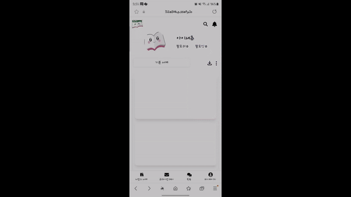
  - 변경 가능한 서재 색상

    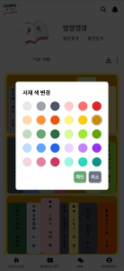

  - 변경 가능한 서재 폰트

    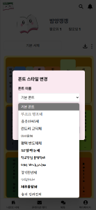

- **책 등록**
  - 책의 기본 정보(제목, 저자, 출판사)를 입력하고, 읽은 상태를 기록합니다.
  - 사용자는 서재에 책을 저장하여 체계적으로 관리할 수 있습니다.
  - 최대 21권의 책을 등록할 수 있습니다.
  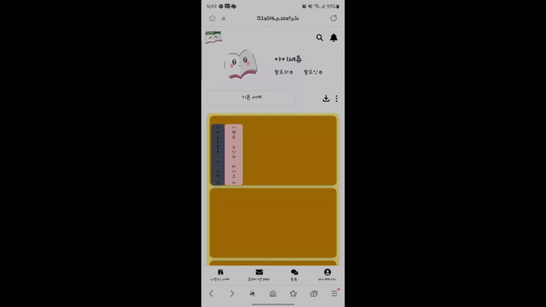

  - 거의 채워진 서재 모습

    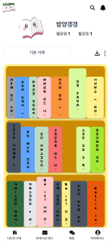

- **서재 내 책 이동**
  - 사용자는 드래그 앤 드롭을 통해 서재 내 책의 순서를 변경할 수 있습니다.
  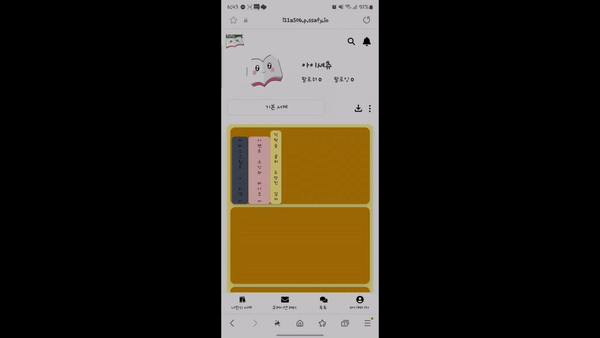

- **한줄평 작성**
  - 사용자는 서재 내 책에 대한 한줄평을 작성할 수 있습니다.
  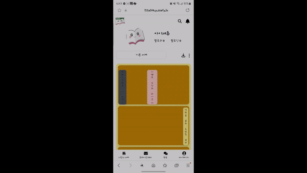

- **파도 타기**
  - 사용자는 서재 내 책을 조회하여 한줄평 파도타기를 할 수 있습니다.
  - 사용자는 다른 사람의 한줄평을 refresh 할 수 있습니다.

  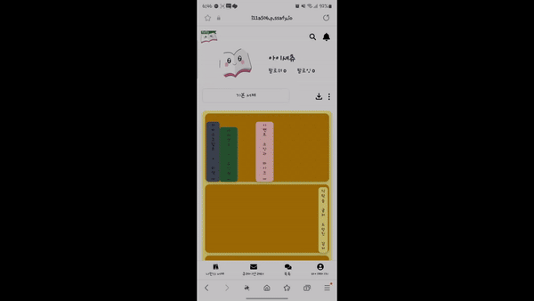

### 큐레이션
- **큐레이션 챗봇을 통한 추천**
  
  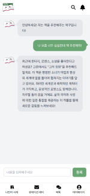
  - 사용자는 큐레이션 챗봇과 대화를 나누며 현재 기분에 맞는 책을 추천받을 수 있습니다.
  - 예를 들어, "우울할 때 읽을 만한 책"을 추천받을 수 있습니다.

- **큐레이션 레터 보내기**

  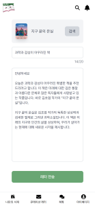
  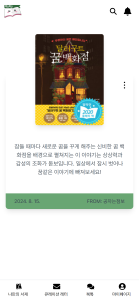
  - 사용자는 큐레이션 레터를 작성하여 다른 사용자에게 보낼 수 있습니다.
  - 팔로워와 일반 사용자들에게 무작위로 레터가 전송됩니다.

- **큐레이션 레터 보관**

  
  
  
  - 사용자는 `받은레터`, `보낸레터`, `보관레터`를 확인할 수 있습니다.

### 북톡 (독서 커뮤니티)
- **북톡 생성 및 소통**

  
  
  - 사용자는 책 제목으로 채팅방을 생성하고, 다른 사용자들과 책에 대한 의견을 나눌 수 있습니다. 
  - 생성된 채팅방에서 독서에 대한 대화를 이어나갈 수 있습니다.

### 알림
- **알림**
  
  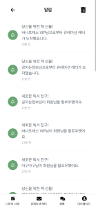
  - 사용자는 큐레이션, 팔로우 등에 대한 알람을 확인할 수 있습니다.

### 마이페이지
- **독서 기록 통계 시각화**

  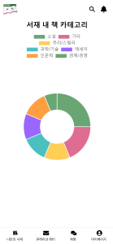
  - 도넛 차트를 통해 사용자의 독서 기록을 시각적으로 확인할 수 있습니다. 
  - 카테고리별 독서량을 분석하여 사용자의 독서 취향을 파악할 수 있습니다.

- **내 글귀**
  - 텍스트

    
    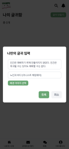
    
  - 이미지(OCR 적용)

    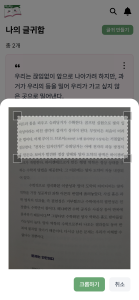
    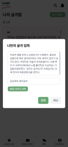
  - 사용자는 책에서 인상깊었던 글귀를 사진/텍스트로 저장할 수 있습니다.
  - 사용자는 사진 업로드 시 OCR을 통해 텍스트를 추출하여 어울리는 배경과 함께 저장할 수 있습니다.
  - 사용자는 직접 텍스트를 입력하여 저장할 수 있습니다.

- **사용자 설정**
  - 프로필 설정

    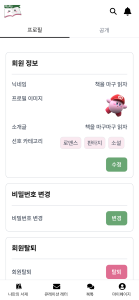

  - 공개 설정

    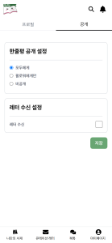

  - 사용자는 프로필과 공개설정을 변경할 수 있습니다.

### 팔로우 및 친구 관리
- **팔로우 및 팔로워 관리**

  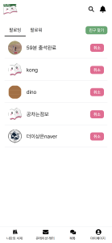
  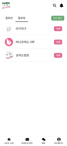
  - 사용자는 관심 있는 다른 사용자를 팔로우하여 그들의 독서 활동을 팔로우 피드에서 확인할 수 있습니다.
  - 팔로우한 사용자의 서재 업데이트, 큐레이션 레터 등을 실시간으로 확인할 수 있습니다.
  - 팔로워 목록과 팔로잉 목록을 통해 서로의 독서 활동을 공유하고 소통할 수 있습니다.
